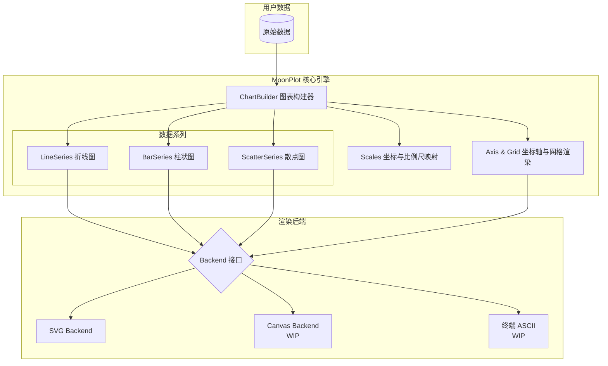

# MoonPlot 🌔📊

一个完全由 [MoonBit](https://www.moonbitlang.com/) 原生编写的声明式、高扩展性的数据可视化与图表渲染库。

[]()
[](https://opensource.org/licenses/MIT)

MoonPlot 旨在填补 MoonBit 应用生态在数据可视化领域的空白，提供一个统一且具备极高扩展性的图表渲染引擎。无论你是需要对算法的 Benchmark 结果进行可视化，还是在后端服务中渲染离线日志，亦或是通过 Wasm 驱动 Web Canvas 渲染，MoonPlot 都能提供简洁优雅的声明式 API。

## ✨ 核心特性

- **渲染后端解耦 (Backend Agnostic)**：核心图形计算与底层输出格式完全解耦。目前原生内置了 `SVGBackend`，未来计划支持 `Canvas` 和终端字符画后端。
- **多图表支持**：内置支持折线图 (Line)、散点图 (Scatter) 与柱状图 (Bar) 等主流图表系列。
- **灵活的坐标与比例尺**：能够将业务数据域（Data Domain）无缝映射到屏幕像素域，支持线性 (Linear)、对数 (Logarithmic) 及分类 (Category) 比例尺。
- **主题与颜色管理**：内置丰富的标准调色板、颜色空间转换与混色算法。

## 🏗️ 架构设计

MoonPlot 采用分层架构设计，极大化其扩展能力。核心引擎负责数学映射与网格布局，最终的绘制命令全部交由 `Backend` 接口执行。



## 🚀 快速开始

下面是一个生成基础 SVG 折线图的概念性示例代码：

```moonbit
// 示例代码 (WIP API)
fn main {
  // 初始化 800x600 的 SVG 渲染后端
  let backend = @svg.SVGBackend::new(800.0, 600.0)
  let chart = @chart.ChartBuilder::new(backend)
    .set_title("我的第一张 MoonPlot 图表")
  
  // 配置比例尺映射 (数据域 0..10 映射到像素)
  let scale_x = @coord.LinearScale::new(0.0, 10.0, 0.0, 800.0)
  let scale_y = @coord.LinearScale::new(0.0, 100.0, 600.0, 0.0)

  // 添加折线图数据
  let data = [(1.0, 10.0), (2.0, 40.0), (3.0, 90.0)]
  let series = @series.LineSeries::new(data).set_color(@color.red)

  // 执行渲染 (框架内部处理图例与坐标系)
  // chart.draw(series)
  println("SVG 图表生成完毕！")
}
```

## 📂 项目结构

```text
MoonPlot/
├── src/
│   ├── backend/    # 渲染后端抽象接口与特定实现 (如 SVG)
│   ├── chart/      # 图表构建器、坐标轴、网格与图例的布局引擎
│   ├── color/      # 颜色结构定义与标准调色板
│   ├── coord/      # 数学坐标系映射与刻度 (Ticks) 计算
│   └── series/     # 数据系列展示形态 (Line, Scatter, Bar)
├── docs/           # 进阶文档与设计说明
├── examples/       # 使用示例代码
└── moon.mod.json   # MoonBit 项目配置
```

## 🎯 赛事规划 (OSC2026)

- [x] 核心系统架构设计与 Trait 抽象
- [x] 基础的 SVG 渲染后端实现
- [x] 基础图表支持：Line, Bar, Scatter
- [x] 面向 MoonBit 的 `moon.pkg.json` 模块化改造
- [ ] 坐标轴刻度 (Tick) 的平滑防碰撞算法
- [ ] 基于 Wasm 的 Canvas 后端集成

## 📄 开源协议

本项目采用 MIT 协议进行开源。
