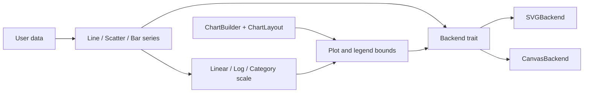

# MoonPlot Architecture

MoonPlot separates data mapping, layout, series geometry and rendering. The dependency direction is intentionally one-way:

## Layout contract

`ChartBuilder::layout()` is the single source of truth for the drawable regions. It reserves the title area, computes the plot rectangle, and estimates the longest legend label so that the legend origin stays to the right of the plot. The calculation clamps tiny canvases to a positive plot size instead of returning inverted bounds.

Grid lines, axes and series all consume the returned plot bounds. Turning the grid off changes only grid emission and does not change scale mapping or series geometry.

## Rendering contract

The `Backend` trait is deliberately primitive: it receives already mapped pixel coordinates and emits line, rectangle, circle, polygon and text operations. SVG serializes those operations immediately; Canvas stores equivalent JavaScript statements until the caller asks for `to_js_code`.

Text is escaped at the backend boundary. SVG uses XML entities, while Canvas escapes JavaScript string delimiters and control characters. This keeps user labels from corrupting generated output.

## Extension points

New series should map their data through `@coord.Scale` and only call `@backend.Backend` operations. New backends can implement the trait without changing chart layout or existing series. New scale types can implement `@coord.Scale` without changing series code.

## Reference scope

The architecture is informed by public concepts from [Plotters](https://github.com/plotters-rs/plotters), [MDN Canvas 2D](https://developer.mozilla.org/en-US/docs/Web/API/CanvasRenderingContext2D), and [W3C SVG](https://www.w3.org/TR/SVG2/). No source code is copied from those projects; MoonPlot's implementation and API are released under MIT.
